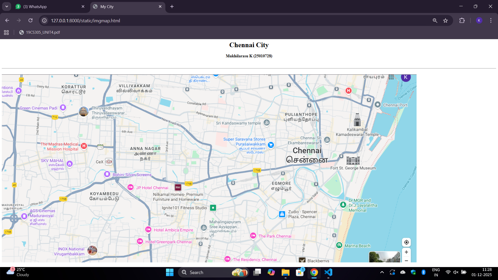
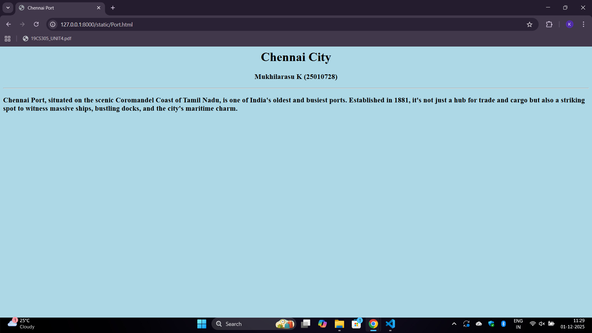
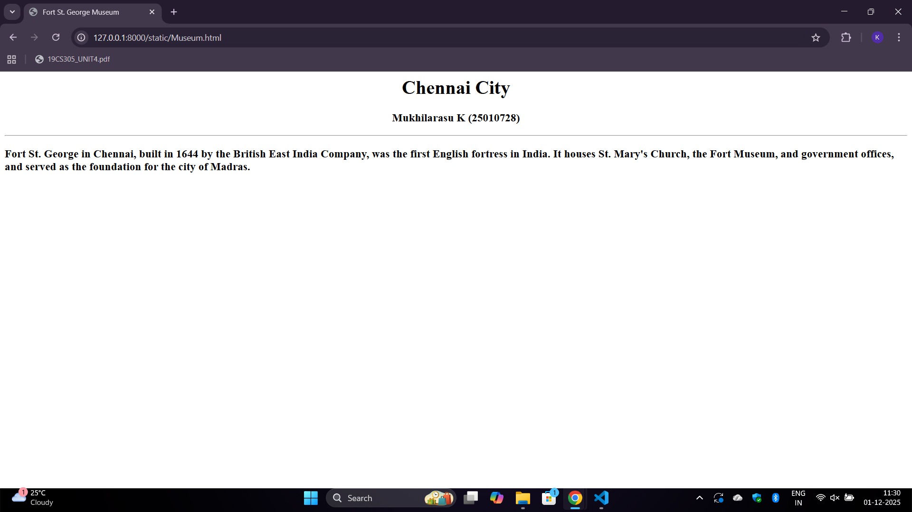
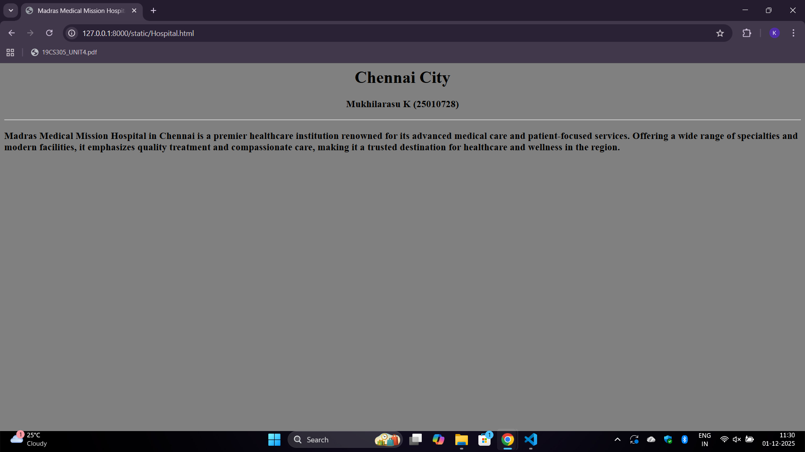
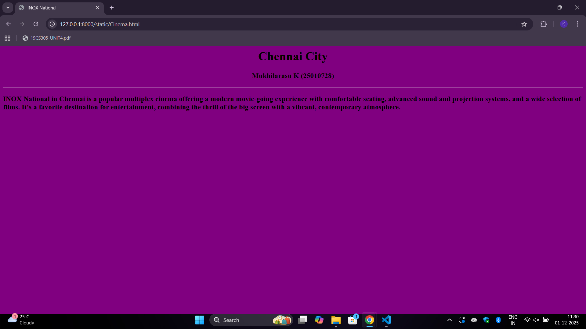
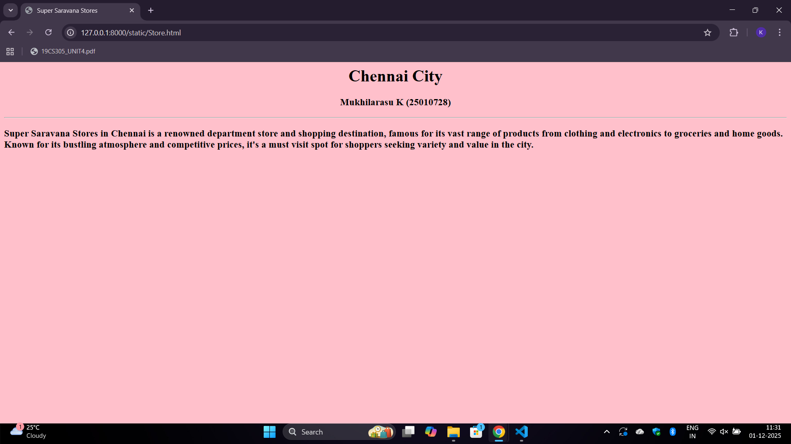

# Ex03 Places Around Me
## Date: 01-12-2025

## AIM
To develop a website to display details about the places around my house.

## DESIGN STEPS

### STEP 1
Create a Django admin interface.

### STEP 2
Download your city map from Google as an image.

### STEP 3
Insert the image using `````` tag and link it to the map.

### STEP 4
Using ```<map>``` tag name the map.

### STEP 5
Create clickable regions in the image using ```<area>``` tag.

### STEP 6
Write HTML programs for all the regions identified.

### STEP 7
Execute the programs and publish them.

## CODE
```
imgmap.html
<html>
    <head>
        <title>My City</title>
    </head>
    <body>
        <h1 align="center" textcolor="blue">Chennai City</h1>
        <h3 align="center" textcolor="red">Mukhilarasu K (25010728)</h3>
        <br>
        

        <map name="image-map">
        <area target="" alt="Fort St. George Museum" title="Fort St. George Museum" href="Museum.html" coords="1626,399,115" shape="circle">
        <area target="" alt="Chennai Port" title="Chennai Port" href="Port.html" coords="1711,123,1897,164" shape="rect">
        <area target="" alt="Madras Medical Hospital" title="Madras Medical Hospital" href="Hospital.html" coords="163,310,269,295,395,307,400,361,174,363" shape="poly">
        <area target="" alt="INOX National" title="INOX National" href="Cinema.html" coords="227,783,456,843" shape="rect">
        <area target="" alt="Super Saravana Stores" title="Super Saravana Stores" href="Store.html" coords="1143,314,123" shape="circle">
        </map>
    </body>
</html>

Port.html
<html>
    <head>
        <title>Chennai Port</title>
    </head>
    <body bgcolor="lightblue">
        <h1 align="center" textcolor="blue">Chennai City</h1>
        <h3 align="center" textcolor="red">Mukhilarasu K (25010728)</h3>
        <hr>
        <h3>Chennai Port, situated on the scenic Coromandel Coast of Tamil Nadu, is one of India's oldest and busiest ports. Established in 1881, it's not just a hub for trade and cargo but also a striking spot to witness massive ships, bustling docks, and the city's maritime charm.</h3>
    </body>
</html>

Museum.html
<html>
    <head>
        <title>Fort St. George Museum</title>
    </head>
    <body>
        <h1 align="center" textcolor="blue">Chennai City</h1>
        <h3 align="center" textcolor="red">Mukhilarasu K (25010728)</h3>
        <hr>
        <h3>Fort St. George in Chennai, built in 1644 by the British East India Company, was the first English fortress in India. It houses St. Mary's Church, the Fort Museum, and government offices, and served as the foundation for the city of Madras.</h3>
    </body>
</html>

Hospital.html
<html>
    <head>
        <title>Madras Medical Mission Hospital</title>
    </head>
    <body bgcolor="grey">
        <h1 align="center" textcolor="blue">Chennai City</h1>
        <h3 align="center" textcolor="red">Mukhilarasu K (25010728)</h3>
        <hr>
        <h3>Madras Medical Mission Hospital in Chennai is a premier healthcare institution renowned for its advanced medical care and patient-focused services. Offering a wide range of specialties and modern facilities, it emphasizes quality treatment and compassionate care, making it a trusted destination for healthcare and wellness in the region.</h3>
    </body>
</html>

Cinema.html
<html>
    <head>
        <title>INOX National</title>
    </head>
    <body bgcolor="purple">
        <h1 align="center" textcolor="blue">Chennai City</h1>
        <h3 align="center" textcolor="red">Mukhilarasu K (25010728)</h3>
        <hr>
        <h3>INOX National in Chennai is a popular multiplex cinema offering a modern movie-going experience with comfortable seating, advanced sound and projection systems, and a wide selection of films. It's a favorite destination for entertainment, combining the thrill of the big screen with a vibrant, contemporary atmosphere.</h3>
    </body>
</html>

Store.html
<html>
    <head>
        <title>Super Saravana Stores</title>
    </head>
    <body bgcolor="pink">
        <h1 align="center" textcolor="blue">Chennai City</h1>
        <h3 align="center" textcolor="red">Mukhilarasu K (25010728)</h3>
        <hr>
        <h3>Super Saravana Stores in Chennai is a renowned department store and shopping destination, famous for its vast range of products from clothing and electronics to groceries and home goods. Known for its bustling atmosphere and competitive prices, it's a must visit spot for shoppers seeking variety and value in the city.</h3>
    </body>
</html>
```

## OUTPUT













## RESULT
The program for implementing image maps using HTML is executed successfully.
